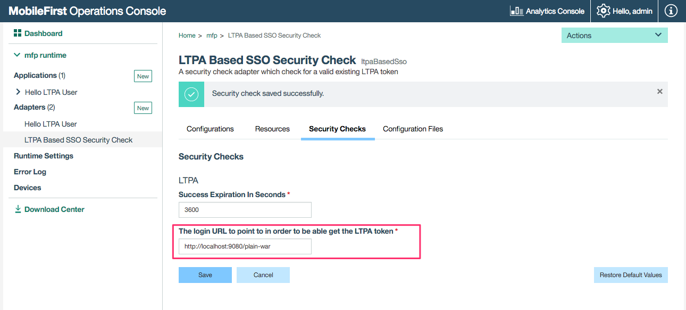

IBM MobileFirst Platform Foundation
===
## Using LTPA Based Security Check Sample
A sample application demonstrating the use of the [LTPA Based](https://www.wikiwand.com/en/IBM_Lightweight_Third-Party_Authentication) Security Check to protect an [IBM MobileFirst Platform](http://www-03.ibm.com/software/products/en/mobilefirstplatform) resource adapter.  This will allow your application to authenticate a user against repositories on the liberty server like [LDAP](https://www.wikiwand.com/en/Lightweight_Directory_Access_Protocol).

This sample contains 4 components:  

1. [The LTPA Based Security Check](./ltpa-based) - This security check validates that the incoming request contains a valid LTPA2 cookie, and extracts the user from it.  
2. [The Resource Adapter](./HelloLTPAUserResourceAdapter) - This is the resource adapter which is protected by the LTPA Based Security Check.  
3. [The WAR project](./plain-war) - This is the WAR project which has the protected resources by Liberty / WebSphere.  
4. [The Sample Swift Application](./LTPABasedSample) - This Swift application sample calls to the resource adapter and displays an alert with "Hello {User}" after a successful authentication.  

### Prerequisites
1. Understanding the IBM MobileFirst Platform [Authentication and Security](https://mobilefirstplatform.ibmcloud.com/tutorials/en/foundation/8.0/authentication-and-security/).
2. Understanding the IBM MobileFirst Platform [Java Adapters](https://mobilefirstplatform.ibmcloud.com/tutorials/en/foundation/8.0/adapters/java-adapters/).
3. Pre-installed IBM MobileFirst Platform [development environment](https://mobilefirstplatform.ibmcloud.com/tutorials/en/foundation/8.0/setting-up-your-development-environment/).

### Usage
- Deploy the security check and the resource adapter:  
  - From a terminal window, navigate to the */ltpa-based* project's root folder and run the commands:  
  ```
  mfpdev adapter build
  mfpdev adapter deploy
  ```
  - Navigate to */HelloLTPAUserResourceAdapter* and run against the above commands.  

  - Your adapters are deployed now.

- Configure The LTPA Based Security Check:
  - From a terminal window run the following command:  

  ```
    mfpdev server console
  ```

  - Navigate to the *Security checks* tab and configure the `login URL`:  
    -  For *BASIC* authentication method set the login URL to point your deployed WAR context (e.g: http://localhost:9080/plain-war).  
    -  For *FORM* authentication method set he login URL point to the FORM action (e.g: http://localhost:9080/plain-war/j_security_check).
    -  The sample by default is configured to use the *BASIC* authentication method. In order to change it to *FORM* authentication method edit the following:    
      - [web.xml](./plain-war/src/main/webapp/WEB-INF/web.xml) in the [plain-war](./plain-war) project.
      - [LTPAChallengeHandler.swift](./LTPABasedSample/LTPABasedSample/LTPAChallengeHandler.swift) in the [LTPABasedSample](./LTPABasedSample) XCode project.  

  

- install and deploy the war file:
  - From a terminal window, navigate to the *plain-war* project's root folder and run the command:
  ```
    mvn install
  ```
  - From *target* folder copy the created file *plain-war.war* into your running liberty server (you can use IBM MobileFirst Platform server for this purpose) and map it in *server.xml*.  For instance, if you copy *plain-war.war* file into *mfp-server* folder on your server, then in your *server.xml* you will need to add the following:   
  ```xml
    <server>
    .
    .
    .
    <application id="plain-war"
                 name="plain-war" location="${wlp.install.dir}/plain-war.war"
                 type="war">
        <application-bnd>
            <security-role name="AllAuthenticated">
                <special-subject type="ALL_AUTHENTICATED_USERS" />
            </security-role>
        </application-bnd>
    </application>
    .
    .
    .
    </server>
  ```  
- Register the sample app:  
  - From a terminal window, navigate to the Swift App XCode project's root folder and run:
  ```
    mfpdev app register
  ```
- Run the sample app:  
  - Open LTPABasedSample.xcworkspace

  - In the XCode project open *mfpclient.plist* and change the *host* property to `localhost` or to the domain you just configured on the security check adapter (The LTPA2 is a Cookie, so the domains need to be equals due to [Cross-site request forgery](https://www.wikiwand.com/en/Cross-site_request_forgery) policy)

  - You can now run the application.

  - If you are are running this sample in front of new development liberty / MFP server then the user repository can be found inside the server.xml file:

  ```xml
  <server>
    ...
    <basicRegistry>
      ...
      <user name="admin" password="admin"/>

    </basicRegistry>
  ...
  </server>
  ```

### Connecting your application to LDAP registry
Connecting to [LDAP](https://www.wikiwand.com/en/Lightweight_Directory_Access_Protocol) can be done with simple configuration in server.xml. To learn more see [Configuring LDAP user registries in Liberty](https://www.ibm.com/support/knowledgecenter/was_beta_liberty/com.ibm.websphere.wlp.nd.multiplatform.doc/ae/twlp_sec_ldap.html).  

As an instance to be able test the connection to an [Online LDAP Test Server](http://www.forumsys.com/en/tutorials/integration-how-to/ldap/online-ldap-test-server/) you need to add the following in your liberty server.xml file:

```xml
<server>
  <featureManager>
    ...
    <feature>ldapRegistry-3.0</feature>
    ...
  </featureManager>
  ...

  <ldapRegistry baseDN="dc=example,dc=com" bindDN="cn=read-only-admin,dc=example,dc=com" bindPassword="password" port="389" host="ldap.forumsys.com" reuseConnection="false" returnToPrimaryServer="false" realm="BasicRegistry" ldapType="Custom"/>

  ...
</server>
```

### Supported Levels
IBM MobileFirst Platform Foundation 8.0

### License
Copyright 2016 IBM Corp.

Licensed under the Apache License, Version 2.0 (the "License");
you may not use this file except in compliance with the License.
You may obtain a copy of the License at

http://www.apache.org/licenses/LICENSE-2.0

Unless required by applicable law or agreed to in writing, software
distributed under the License is distributed on an "AS IS" BASIS,
WITHOUT WARRANTIES OR CONDITIONS OF ANY KIND, either express or implied.
See the License for the specific language governing permissions and
limitations under the License.
