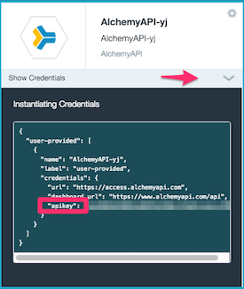
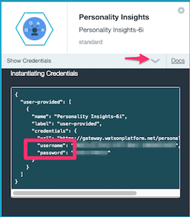
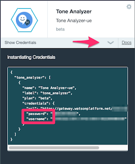

IBM MobileFirst Platform Foundation
===

## Analyze My Facebook Adapter
This adapter demonstrate:

1. Ability to protect resource using facebook login. 
2. How to connect to [Watson services](http://www.ibm.com/smarterplanet/us/en/ibmwatson/developercloud/services-catalog.html) like:
    * [AlchemyAPI](http://www.ibm.com/smarterplanet/us/en/ibmwatson/developercloud/alchemy-language.html)
    * [Personality Insights](http://www.ibm.com/smarterplanet/us/en/ibmwatson/developercloud/personality-insights.html)
    * [Tone Analyzer](http://www.ibm.com/smarterplanet/us/en/ibmwatson/developercloud/tone-analyzer.html)
3. This adapter obtains a Facebook access token from the logged-in user and provides insights based on the user profile picture and the user feed.
4. To test this adapter you can use the following native Android app [AnalyzeMyFacebookApp](../AnalyzeMyFacebookApp/README.md)

## Maven
* The adapter is a [maven](https://maven.apache.org/) project.  It's easy to add dependencies:  
e.g.: to add [Watson Java SDK](https://github.com/watson-developer-cloud/java-sdk) all is needed - add those lines to dependencies node in [pom.xml](pom.xml):
```
<dependency>
         <groupId>com.ibm.watson.developer_cloud</groupId>
         <artifactId>java-sdk</artifactId>
         <version>2.9.0</version>
</dependency>
```
    
### Prerequisites
* A local installation of maven (JDK 1.7 or 1.8)

### Build and install
* Deploy the [social-login](../../../social-login/README.md) security check (under custom-security-checks folder)
* build the adapter application using maven:
    * From a **Command-line**, navigate to the **AnalyzeMyFacebookAdapter** project's root folder
    * Build the API using maven by executing `mvn clean install`
* Deploy the built adapter into your MobileFirst server by running `mvn adapter:deploy` (assure that your MobileFirst
  server connection parameters are updated in the **pom.xml** file)
* Log into the MobileFirst console and update the Adapter configuration parameters
    * `alchemyAPIKey` - You can obtain it from a bounded [AlchemyAPI service](http://www.ibm.com/smarterplanet/us/en/ibmwatson/developercloud/alchemy-language.html) in [BlueMix](http://www.ibm.com/cloud-computing/bluemix/).
    * `personalityInsightUser` & `personalityInsightPassword` - You can obtain it from the a bounded [Personality Insights Watson service](http://www.ibm.com/smarterplanet/us/en/ibmwatson/developercloud/personality-insights.html) in [BlueMix](http://www.ibm.com/cloud-computing/bluemix/).     
    * `toneAnalyzerUser` & `toneAnalyzerPassword` - You can obtain it from the a bounded [TokenAnalyzer Watson service](http://www.ibm.com/smarterplanet/us/en/ibmwatson/developercloud/tone-analyzer.html) in [BlueMix](http://www.ibm.com/cloud-computing/bluemix/).
    
* You are done.
* To test it you can use this Android sample [AnalyzeMyFacebookApp](../AnalyzeMyFacebookApp/README.md) 

**Where can I find the services credentials in [BlueMix](http://www.ibm.com/cloud-computing/bluemix/)?
You can find the service credentials in your [BlueMix](http://www.ibm.com/cloud-computing/bluemix/) runtime application, under each service box:

  
   

### Supported Levels
IBM MobileFirst Platform Foundation 8.0

## License
Copyright 2016 IBM Corp.

Licensed under the Apache License, Version 2.0 (the "License");
you may not use this file except in compliance with the License.
You may obtain a copy of the License at

http://www.apache.org/licenses/LICENSE-2.0

Unless required by applicable law or agreed to in writing, software
distributed under the License is distributed on an "AS IS" BASIS,
WITHOUT WARRANTIES OR CONDITIONS OF ANY KIND, either express or implied.
See the License for the specific language governing permissions and
limitations under the License.